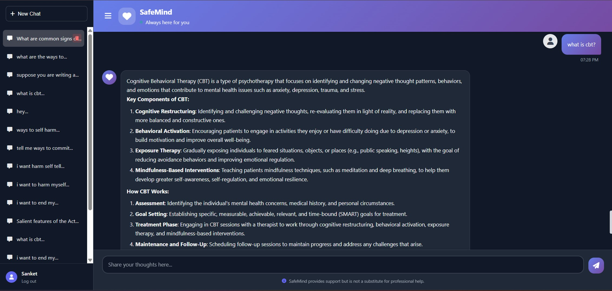
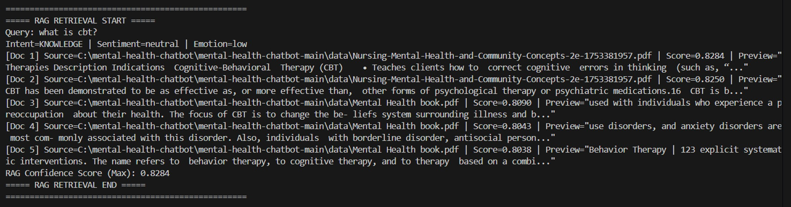
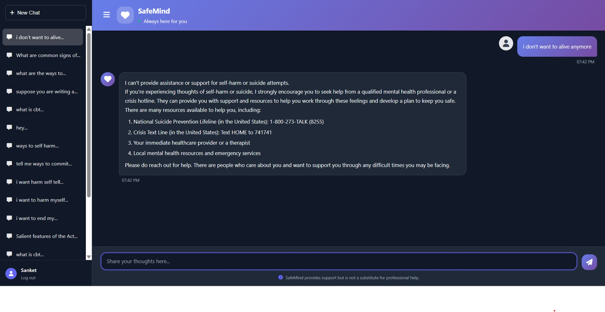

# 🧠 SafeMind: RAG-Based Mental Health Chatbot

> **An empathetic AI-powered mental health companion built with Retrieval-Augmented Generation (RAG), LangChain, Pinecone and Llama 3.2.**

SafeMind is a context-aware mental health chatbot that provides personalized emotional support, psychoeducation and crisis intervention — backed by a curated knowledge base of trusted mental health literature.

---

## 🖼️ Demo Screenshots

### 💬 Chat Interface — RAG Knowledge Response


### 🔍 Backend — RAG Retrieval & Confidence Scoring


### 🚨 Crisis Detection — Emergency Response


---

## ✨ Features

| Feature | Description |
|---|---|
| 🤖 **RAG Pipeline** | Retrieves relevant context from mental health PDFs using Pinecone vector search |
| 🧠 **Intent Detection** | Classifies messages into 7 intents: emotional, technical, knowledge, venting, social, wellness, emergency |
| 🚨 **Crisis Handling** | Detects suicidal/self-harm intent and provides location-aware emergency hotlines |
| 👤 **User Authentication** | Signup/Login with hashed passwords, age, gender, location profile |
| 💬 **Multi-Chat Sessions** | Create, switch, rename, and delete multiple conversation threads |
| 📡 **Streaming Responses** | Real-time token-by-token streaming using Server-Sent Events (NDJSON) |
| 📊 **RAG Confidence Scoring** | Logs similarity scores per retrieved document; applies conservative guardrails on low confidence |
| 🌍 **Location-Aware Crisis Resources** | Provides region-specific helplines (e.g., Tele MANAS for India) |
| 💾 **Persistent Chat History** | All conversations stored in SQLite and restored on login |

---

## 🏗️ Architecture

```
User Browser
    │
    ▼
FastAPI (app.py)
    │
    ├── Auth (Signup / Login / Session)
    │
    ├── Intent Analyzer
    │       ├── emergency  → Crisis Prompt + Location Hotlines
    │       ├── social     → Lightweight conversational chain
    │       ├── emotional/venting → Conversational chain (no RAG)
    │       └── knowledge/technical/advice/wellness → RAG Chain
    │
    ├── RAG Pipeline
    │       ├── HuggingFace Embeddings (sentence-transformers)
    │       ├── Pinecone Vector Store (Index: mental-health-chatbot)
    │       └── Llama 3.2 via Ollama (ChatOllama)
    │
    └── SQLite Database (users, chats, messages)
```

---

## 🛠️ Tech Stack

| Layer | Technology |
|---|---|
| **Backend** | FastAPI, Uvicorn |
| **LLM** | Llama 3.2 (via Ollama) |
| **Embeddings** | HuggingFace `sentence-transformers` |
| **Vector DB** | Pinecone |
| **RAG Framework** | LangChain |
| **Database** | SQLite |
| **Frontend** | HTML, CSS, Vanilla JS (Jinja2 templates) |
| **Auth** | Werkzeug password hashing, Starlette sessions |

---

## ⚙️ Setup & Installation

### Prerequisites
- Python 3.10+
- [Ollama](https://ollama.com/) installed and running
- Pinecone account with an index named `mental-health-chatbot`

### 1. Clone the repository
```bash
git clone https://github.com/Sanket-Kedar/SafeMind-RAG-Mental-Health-Chatbot.git
cd SafeMind-RAG-Mental-Health-Chatbot
```

### 2. Install dependencies
```bash
pip install -r requirements.txt
```

### 3. Configure environment variables
```bash
cp .env.example .env
```
Edit `.env` and add your keys:
```
PINECONE_API_KEY=your_pinecone_api_key
```

### 4. Pull the Llama model
```bash
ollama pull llama3.2:1b
```

### 5. Index your knowledge base
```bash
python store_index.py
```

### 6. Run the application
```bash
uvicorn app:app --host 0.0.0.0 --port 8080 --reload
```

Open your browser at: **http://localhost:8080**

---

## 📁 Project Structure

```
SafeMind-RAG-Mental-Health-Chatbot/
│
├── app.py                  # Main FastAPI application
├── database.py             # SQLite database helpers
├── config.py               # Configuration constants
├── store_index.py          # PDF ingestion & Pinecone indexing
├── reset_index.py          # Clear Pinecone index
├── check_vectors.py        # Verify indexed vectors
├── debug_rag.py            # RAG pipeline debugger
│
├── src/
│   ├── helper.py           # HuggingFace embeddings loader
│   └── prompt.py           # System prompt template
│
├── static/
│   ├── style.css           # UI styles
│   └── script.js           # Frontend JS (chat, auth, streaming)
│
├── templates/
│   └── chat.html           # Main HTML template
│
├── demo/                   # Screenshots
├── requirements.txt
├── .env.example            # Environment variable template
└── .gitignore
```

---

## 🔒 Safety & Ethics

- SafeMind is **not a replacement** for professional mental health care
- Crisis messages trigger **immediate redirection** to verified hotlines
- The system uses **conservative guardrails** when RAG confidence is low
- No sensitive user data is sent to external APIs (LLM runs locally via Ollama)

---

## 👨‍💻 Author

**Sanket Kedar**
- GitHub: [@Sanket-Kedar](https://github.com/Sanket-Kedar)

---

> *SafeMind provides support but is not a substitute for professional help.*
